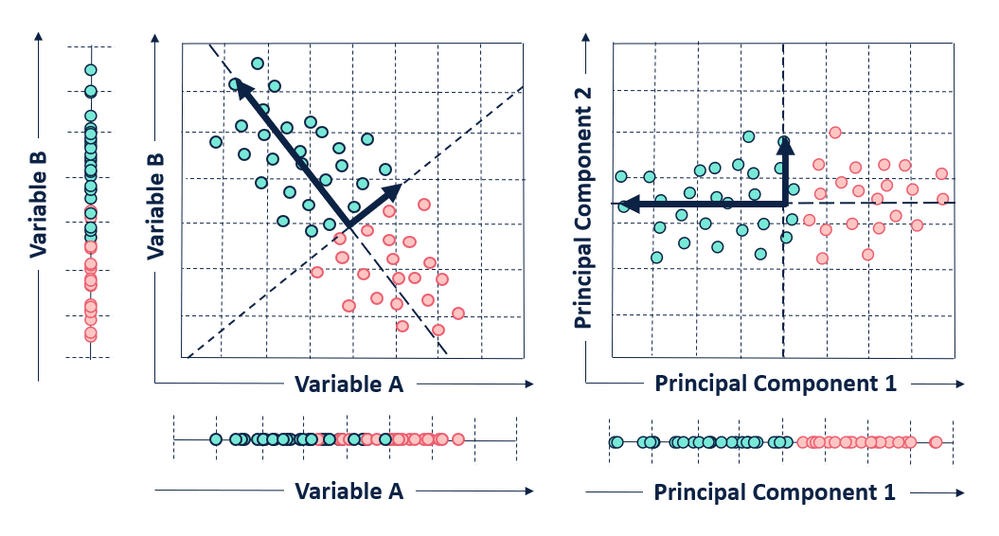
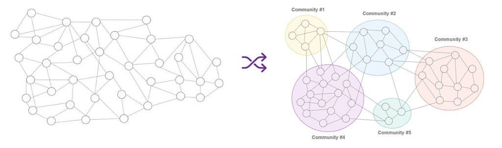

```{r setup, include=FALSE}
knitr::opts_chunk$set(echo = TRUE)
```

```{r}
install.packages("dplyr")
install.packages("SeuratObject")
install.packages("Seurat")

install.packages("devtools")
devtools::install_github("thomasp85/patchwork")

install.packages('NMF')
devtools::install_github("jokergoo/circlize")
devtools::install_github("jokergoo/ComplexHeatmap") 
devtools::install_github("jinworks/CellChat")
install.packages("HGNChelper")
```


```{r}
library(dplyr)
library(Seurat)
library(SeuratObject)
library(patchwork)
```


## 1. Load the dataset

The dataset we are going to be analysing today consists of human peripheral blood mononuclear cells (PBMCs), which are isolated from peripheral blood and identified as any blood cell with a round nucleus (i.e. lymphocytes, monocytes, natural killer cells (NK cells) or dendritic cells).

The dataset can be downloaded from https://cf.10xgenomics.com/samples/cell/pbmc3k/pbmc3k_filtered_gene_bc_matrices.tar.gz
```{r}
# Load the PBMC dataset
pbmc.data <- Read10X(data.dir = "filtered_gene_bc_matrices/hg19/")

# Initialize the Seurat object with the raw (non-normalized data).
pbmc <- CreateSeuratObject(counts = pbmc.data, project = "pbmc3k", min.cells = 3, min.features = 200)
pbmc
```

## 2. Quality-control

#### Commonly used QC metrics:

1. The number of unique genes detected in each cell.
    Low-quality cells or empty droplets will often have very few genes
    Cell doublets or multiplets may exhibit an aberrantly high gene count
  
2. Similarly, the total number of molecules detected within a cell (correlates strongly with unique genes)

3. The percentage of reads that map to the mitochondrial genome
    Low-quality / dying cells often exhibit extensive mitochondrial contamination

```{r}
#We calculate mitochondrial QC metrics with the PercentageFeatureSet() function, which calculates the percentage of counts originating from a set of features
#We use the set of all genes starting with MT- as a set of mitochondrial genes
pbmc[["percent.mt"]] <- PercentageFeatureSet(pbmc, pattern = "^MT-")
```


In the example below, we visualize QC metrics, and use these to filter cells.

1. We filter cells that have unique feature counts over 2,500 or less than 200
2. We filter cells that have >5% mitochondrial counts

```{r}
# Visualize QC metrics as a violin plot
VlnPlot(pbmc, features = c("nFeature_RNA", "nCount_RNA", "percent.mt"), ncol = 3)
```


```{r}
pbmc <- subset(pbmc, subset = nFeature_RNA > 200 & nFeature_RNA < 2500 & percent.mt < 5)
dim(pbmc)
```

## 3. Pre-processing

After removing unwanted cells from the dataset, the next step is to pre-process the data. First, we normalize scRNAseq counts:

1. Divide each cell by the total number of transcript measured in the cell
2. Multiply that number by a scaling factor (i.e. 10000)
3. Add 1, and take a natural log

```{r}
pbmc <- NormalizeData(pbmc)
```

We next calculate a subset of features that exhibit high cell-to-cell variation in the dataset (i.e, they are highly expressed in some cells, and lowly expressed in others). Focusing on these genes in downstream analysis helps to highlight biological signal in single-cell datasets. By default, we return 2,000 features per dataset. These will be used in downstream analysis, like PCA.

```{r, fig.width=5,fig.height =3, fig.wide = TRUE, fig.align = "center"}
pbmc <- FindVariableFeatures(pbmc, selection.method = "vst", nfeatures = 2000)

# plot variable features
top10 <- head(VariableFeatures(pbmc), 10)
plot1 <- VariableFeaturePlot(pbmc)
plot2 <- LabelPoints(plot = plot1, points = top10, repel = TRUE)
plot2
```


Next, we apply a linear transformation (‘scaling’) that is a standard pre-processing step prior to dimensional reduction techniques like PCA. The ScaleData() function:

1. Shifts the expression of each gene, so that the mean expression across cells is 0
2. Scales the expression of each gene, so that the variance across cells is 1. This step gives equal weight in downstream analyses, so that highly-expressed genes do not dominate

```{r}
all.genes <- rownames(pbmc)
pbmc <- ScaleData(pbmc, features = all.genes)
```


Next we perform PCA on the scaled data

PCA is a statistical technique for reducing the dimensionality of a dataset. This is accomplished by linearly transforming the data into a new coordinate system where (most of) the variation in the data can be described with fewer dimensions than the initial data. 


```{r echo=FALSE, out.width='80%'}
library(knitr)

```

```{r, fig.width=7,fig.height =10, fig.wide = TRUE, fig.align = "center"}
pbmc <- RunPCA(pbmc, features = VariableFeatures(object = pbmc), verbose=F)

#DimHeatmap() allows for easy exploration of the primary sources of heterogeneity in a dataset, and can be useful when trying to decide which PCs to include for further downstream analyses. Both cells and features are ordered according to their PCA scores. Setting cells to a number plots the ‘extreme’ cells on both ends of the spectrum, which dramatically speeds plotting for large datasets. Though clearly a supervised analysis, we find this to be a valuable tool for exploring correlated feature sets.
DimHeatmap(pbmc, dims = 1:15, cells = 500, balanced = TRUE)
```


#### Determine the ‘dimensionality’ of the dataset

To overcome the extensive technical noise in any single feature for scRNA-seq data, Seurat clusters cells based on their PCA scores, with each PC essentially representing a ‘metafeature’ that combines information across a correlated feature set. The top principal components therefore represent a robust compression of the dataset. However, how many components should we choose to include? 

To answer this, an ‘Elbow plot’ is generated. It ranks principle components based on the percentage of variance explained by each one. In this example, we can observe an ‘elbow’ around PC9-10, suggesting that the majority of true signal is captured in the first 10 PCs.


```{r}
ElbowPlot(pbmc)
```


## 4. Perform clustering

We first construct a KNN graph based on the euclidean distance in PCA space. This step is performed using the FindNeighbors() function, and takes as input the previously defined dimensionality of the dataset (first 10 PCs).

To cluster the cells, we next apply modularity optimization techniques such as the Louvain algorithm to iteratively group cells together, with the goal of optimizing the standard modularity function. The FindClusters() function implements this procedure, and contains a resolution parameter that sets the ‘granularity’ of the downstream clustering, with increased values leading to a greater number of clusters. We find that setting this parameter between 0.4-1.2 typically returns good results for single-cell datasets of around 3K cells. 


```{r echo=FALSE, out.width='80%'}
library(knitr)

```


```{r}
pbmc <- FindNeighbors(pbmc, dims = 1:10, nn.method="rann")
pbmc <- FindClusters(pbmc, resolution = 0.5)
pbmc <- RunUMAP(pbmc, dims = 1:10)

# Visualization
DimPlot(pbmc, reduction = "umap", label=T)
```

## 5. Annotate the clusters

```{r}
install.packages("HGNChelper")
library(HGNChelper)
```

```{r}
# download gene set preparation function
#source("https://raw.githubusercontent.com/IanevskiAleksandr/sc-type/master/R/gene_sets_prepare.R")
# load cell type annotation function
#source("https://raw.githubusercontent.com/IanevskiAleksandr/sc-type/master/R/sctype_score_.R")
# DB file
#db_ = "https://raw.githubusercontent.com/IanevskiAleksandr/sc-type/master/ScTypeDB_full.xlsx";
```

The most important thing needed for cluster annotation is a list of marker genes, whose expression indicates a particular cell type.

```{r}
#load the functions and the dataset
source("scType_data/gene_sets_prepare.R")
source("scType_data/sctype_score_.R")
db_ <- "scType_data/ScTypeDB_full.xlsx"

# prepare gene sets
tissue = "Immune system"
gs_list = gene_sets_prepare(db_, tissue)
```

Today, we are going to use automated cell type annotation. Briefly, it assigns a positive score to positive markers, and a negative score to negative markers. It then calculates the average expression of of these two types of markers in each cell, and generates a combined score for each potential cell type. 

```{r}
#Finally, let's assign cell types to each cluster: 

# get cell-type by cell matrix
es.max = sctype_score(scRNAseqData = pbmc@assays[["RNA"]]@scale.data, scaled = TRUE, 
                      gs = gs_list$gs_positive, gs2 = gs_list$gs_negative) 

# merge by cluster
cL_resutls = do.call("rbind", lapply(unique(pbmc@meta.data[["seurat_clusters"]]), function(cl){
    es.max.cl = sort(rowSums(es.max[ ,rownames(pbmc@meta.data[pbmc@meta.data[["seurat_clusters"]]==cl, ])]), decreasing = !0)
    head(data.frame(cluster = cl, type = names(es.max.cl), scores = es.max.cl, ncells = sum(pbmc@meta.data[["seurat_clusters"]]==cl)), 10)
}))
sctype_scores = cL_resutls %>% group_by(cluster) %>% top_n(n = 1, wt = scores)  

print(sctype_scores[,1:3])
```

```{r}
pbmc@meta.data$customclassif = ""
for(j in unique(sctype_scores$cluster)){
  cl_type = sctype_scores[sctype_scores$cluster==j,]; 
  pbmc@meta.data$customclassif[pbmc@meta.data$seurat_clusters == j] = as.character(cl_type$type[1])
}

DimPlot(pbmc, reduction = "umap", label = TRUE, group.by = 'customclassif')        
```


```{r}
#Rename the annotated clusters

pbmc@meta.data[["customclassif"]] <- gsub("^Classical Monocytes$", "Classical Mono", pbmc@meta.data[["customclassif"]])
pbmc@meta.data[["customclassif"]] <- gsub("^Non-classical monocytes$", "Non-classical mono", pbmc@meta.data[["customclassif"]])
pbmc@meta.data[["customclassif"]] <- gsub("^Natural killer  cells$", "NK cells", pbmc@meta.data[["customclassif"]])
pbmc@meta.data[["customclassif"]] <- gsub("^Myeloid Dendritic cells$", "DC", pbmc@meta.data[["customclassif"]])

DimPlot(pbmc, reduction = "umap", label = TRUE, repel = FALSE, group.by = 'customclassif')
```

## 6. Signalling analysis

```{r}
devtools::install_github("sqjin/CellChat")
library(CellChat)
options(stringsAsFactors = FALSE)
```

#### Part I: Data input & processing and initialization of CellChat object

```{r}
# create a new CellChat object 
cellchat <- createCellChat(object = pbmc, group.by = "customclassif")
```

```{r}
cellchat <- setIdent(cellchat, ident.use = "customclassif") # set "customclassif" as default cell identity
#groupSize <- as.numeric(table(cellchat@idents)) # number of cells in each cell group
```

Once that is complete, we need to import a database of ligand-receptor interactions.

```{r}
#Set the ligand-receptor interaction database

CellChatDB <- CellChatDB.human
showDatabaseCategory(CellChatDB)

# use a subset of CellChatDB for cell-cell communication analysis
CellChatDB.use <- subsetDB(CellChatDB, search = "Secreted Signaling") # use Secreted Signaling
# use all CellChatDB for cell-cell communication analysis
# CellChatDB.use <- CellChatDB # simply use the default CellChatDB

# set the used database in the object
cellchat@DB <- CellChatDB.use
```


To infer the cell state-specific communications, we identify over-expressed ligands or receptors in one cell group and then identify over-expressed ligand-receptor interactions if either ligand or receptor is over-expressed.
```{r}
# subset the expression data of signaling genes for saving computation cost
cellchat <- subsetData(cellchat) # This step is necessary even if using the whole database
future::plan("multisession", workers = 4) # do parallel
cellchat <- identifyOverExpressedGenes(cellchat)
cellchat <- identifyOverExpressedInteractions(cellchat)

```

#### Part II: Compute the communication probability and infer cellular communication network

communication probability is computed using the law of mass action. In simplified terms, we multiply the ligand and receptor levels together -> the higher the product, the higher the probability that the interaction occurs

```{r}
#Compute the communication probability/strength between any interacting cell groups
cellchat <- computeCommunProb(cellchat)
# Filter out the cell-cell communication if there are only few number of cells in certain cell groups
cellchat <- filterCommunication(cellchat, min.cells = 10)

# compute the communication probability on signaling pathway level by summarizing the communication probabilities of all ligands-receptors interactions associated with each signaling pathway.
cellchat <- computeCommunProbPathway(cellchat)
#calculate the aggregated cell-cell communication network by counting the number of links or summarizing the communication probability
cellchat <- aggregateNet(cellchat)
```

#### Part III: Visualization of cell-cell communication network

```{r, fig.width=7,fig.height =10, fig.wide = TRUE, fig.align = "center"}
# visualize the aggregated cell-cell communication network. 

groupSize <- as.numeric(table(cellchat@idents))
netVisual_circle(cellchat@net$count, vertex.weight = groupSize, weight.scale = T, label.edge= F, title.name = "Number of interactions")

mat <- cellchat@net$weight
par(mfrow = c(4,3), xpd=TRUE)
for (i in 1:nrow(mat)) {
  mat2 <- matrix(0, nrow = nrow(mat), ncol = ncol(mat), dimnames = dimnames(mat))
  mat2[i, ] <- mat[i, ]
  netVisual_circle(mat2, vertex.weight = groupSize, weight.scale = T, edge.weight.max = max(mat), title.name = rownames(mat)[i])
}
```

```{r}
pathways.show <- c("MIF") #Macrophage migration inhibitory factor
# Circle plot
netVisual_aggregate(cellchat, signaling = pathways.show)
```


Compute the contribution of each ligand-receptor pair to the overall signaling pathway and visualize cell-cell communication mediated by a single ligand-receptor pair

```{r, fig.width=8,fig.height =3, fig.wide = TRUE, fig.align = "center"}
netAnalysis_contribution(cellchat, signaling = pathways.show)
```
We can also visualize the cell-cell communication mediated by a single ligand-receptor pair. 

```{r}
pairLR.MIF <- extractEnrichedLR(cellchat, signaling = pathways.show, geneLR.return = FALSE)

# Circle plot
LR.show <- pairLR.MIF[1,] # show the first ligand-receptor pair
netVisual_individual(cellchat, signaling = pathways.show, pairLR.use = LR.show, layout = "circle")

LR.show <- pairLR.MIF[2,] # show the second ligand-receptor pair
netVisual_individual(cellchat, signaling = pathways.show, pairLR.use = LR.show, layout = "circle")
```

Plot the signaling gene expression distribution using violin/dot plot

```{r, fig.width=12,fig.height =6, fig.wide = TRUE, fig.align = "center"}
plotGeneExpression(cellchat, signaling = "MIF")
```


Identify signaling roles (e.g., dominant senders, receivers) of cell groups as well as the major contributing signaling

Specifically, we used measures in weighted-directed networks, including out-degree and in-degree, to respectively identify dominant senders and receivers for the intercellular communications. In a weighted directed network with the weights as the computed communication probabilities, the outdegree, computed as the sum of communication probabilities of the outgoing signaling from a cell group, and the in-degree, computed as the sum of the communication probabilities of the incoming signaling to a cell group, can be used to identify the dominant cell senders and receivers of signaling networks, respectively. 

```{r}
# Compute the network centrality scores
cellchat <- netAnalysis_computeCentrality(cellchat, slot.name = "netP") # the slot 'netP' means the inferred intercellular communication network of signaling pathways
# Visualize the computed centrality scores using heatmap, allowing ready identification of major signaling roles of cell groups
netAnalysis_signalingRole_network(cellchat, signaling = pathways.show, width = 8, height = 2.5, font.size = 10, measure.name = c("Sender", "Receiver"), measure=c("outdeg", "indeg"))
```

Identify signals contributing most to outgoing or incoming signaling of certain cell groups

```{r, fig.width=6,fig.height =4, fig.wide = TRUE, fig.align = "center"}
# Signaling role analysis on the aggregated cell-cell communication network from all signaling pathways
ht1 <- netAnalysis_signalingRole_heatmap(cellchat, pattern = "outgoing")
ht2 <- netAnalysis_signalingRole_heatmap(cellchat, pattern = "incoming")
ht1 + ht2
```


